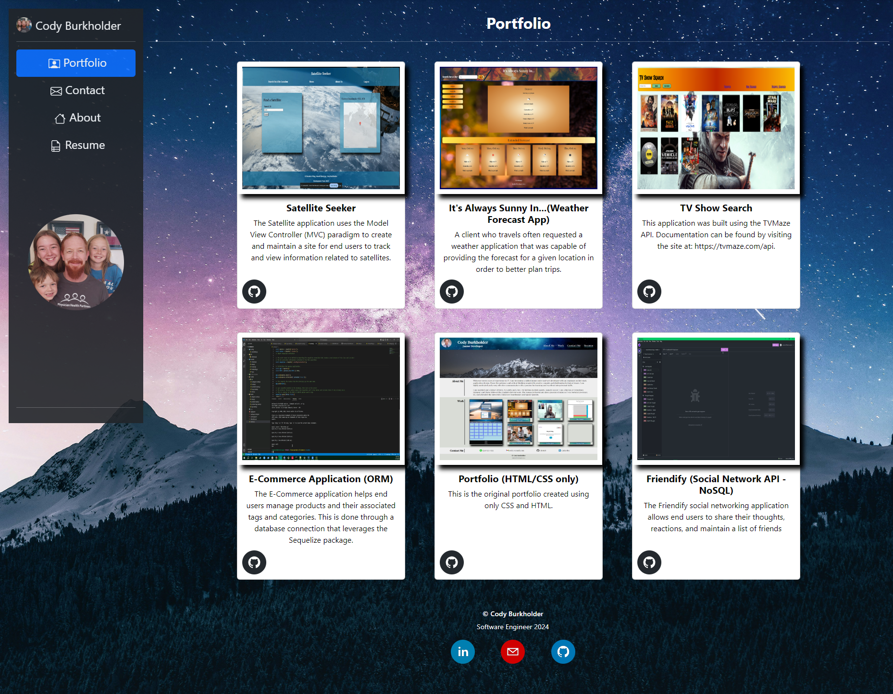

# React Portfolio

This is a React-based portfolio application.  It was built using React, JavaScript, Bootstrap, and Netlify.

## Table of Contents

- [Installation](#installation)
- [Usage](#usage)
- [License](#license)
- [Contact](#contact)

## Description

This is a professional portfolio about the developer built using React.  The portfolio provides an About section with personal information.  It also features a Portfolio section that showcases current and past projects.  A contact form has been included that delivers messages and provides visitors with an opportunity to send a message.  The deployed application can be found here: [React Portfolio](https://cburkreactportfolio.netlify.app/).



## Technologies Used

- React
- JavaScript
- Bootstrap
- Netlify
- HTML
- CSS

## Installation

1. Clone the repository:

   ```bash
   git clone https://github.com/chilejay7/React-Portfolio.git
    ``````

2. Navigate to the project's directory:
    ```bash
    cd react-portfolio
    ``````


3. Install Dependencies

    ```bash
    npm install
    ``````

## Usage

Start the development server:
   ```bash
   npm start
   ``````

Open your browser and visit http://localhost:5050 to view the portfolio application.


## License

[License: MIT](https://opensource.org/licenses/MIT)

## Contact

If you have any questions, please feel free to contact me using the information provided below:  
  
GitHub: [chilejay7](https://github.com/chilejay7?tab=repositories)  
Email: codyburk7@gmail.com